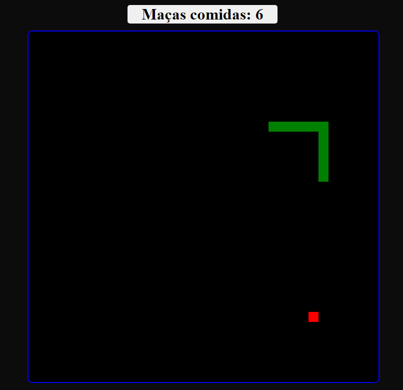

<b><kbd>Português</kbd></b>

<b>Jogo da cobra</b>

Jogo da cobrinha feito com Html, css e Javascript.

-- Sitema de pontuação
-- Derrota e vitória

<b>Linguagens e ferramentas:</b> 

<b><kbd>English</kbd></b>

<b>Simple CRUD for a table of Employees</b>

Game of snake make with HTML, CSS and Javascript

--Score system
--Lose and win

<b>Languages and Tools:</b> 

